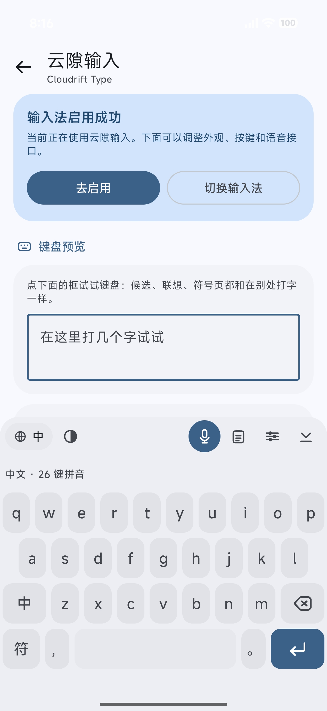
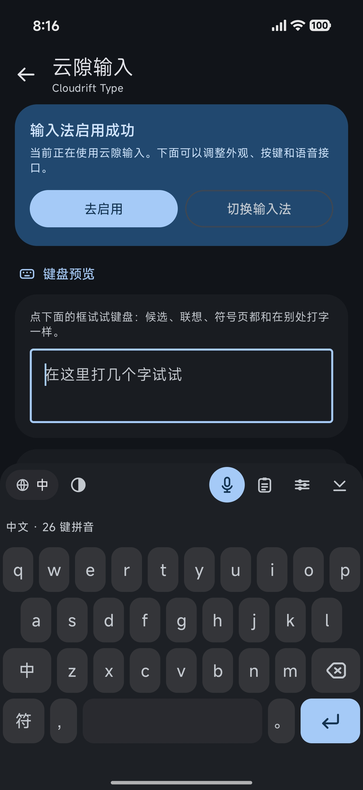
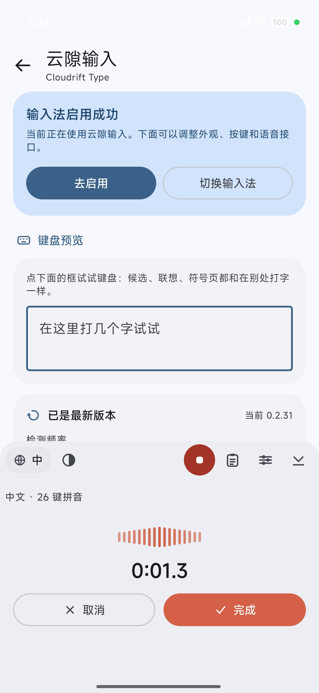

# 云隙输入 · Cloudrift Type

<p align="center">
  
</p>

<p align="center">
  
  
  
</p>

<p align="center"><sub>左起：设置页的键盘预览（浅色 / 深色）、按住空格说话的录音面板</sub></p>

一个 Android 输入法（IME），界面按 **Material 3 Expressive** 设计，支持中文（26 键 /
9 键拼音）、日文（罗马音 / 假名）与英文，并内置基于 API Key 的语音输入。

## 功能

- **中文**：26 键拼音与 9 键（T9）拼音，共用同一套词典引擎。除了整词匹配，还会给出
  **码前缀补全**：`nih` 就已经能选出`你好`（未打完的`好`用淡色标出），单个字母也会列出
  `那/你/能` 这类常见字，不必把整串拼音打完。补全补的是**你给过线索的字**：`kan` 只出
  `看/砍/堪/刊…` 这些单字，`看到` 要等你把 `d` 打出来（`kand`）；同样 `ni` 出`你`，
  `你好` 等在 `nih` 之后。**单字一颗都不省**：一个音节配多少字就列多少（`ji` 的 `髻`、
  `yi` 的 `嶷` 都在列表里，往下滚或者点开「更多候选」就能拿到），不再按旧上限截断。
  **9 键是五列**：数字（字母是主体、数字小字压在上方）占中间三列，左边一列 `符 / ，/ 。`、
  右边一列 `⌫ / 中 / 换行`，空格键正好铺在数字下面——主输入区在正中间，不往左偏。
- **中文模式下的英文**：拼音键盘上打英文词也认——`hello` 直接出 `hello`（中文这边只有
  `喝理论喔` 这种不成词的读法，所以它排第一），`compu` 出 `computer`、`beauti` 出
  `beautiful`。**没有拼错**是前提（那串字母必须是候选词的前缀），够不够格看词有多长：
  **3 个字母以内要整词打满**（`men` 得把 m-e-n 全打出来），**4 个字母以上至少打 4 个字母、
  并且打到 60%**（`like` 打满即出）。它和中文字按**权重**排序：拼得越全排得越前，
  而拼音真的打出一个词时那个词仍然在先（`women` 第一是`我们`，`women` 紧随其后）。
  词表是**小初高一直到高考**的课程标准词汇（3,997 词，见下），课本上的词也认得。
- **大小写**：中文模式下 `Z` 左边那颗是**大小写键**（原来那颗中英切换挪走了——切语言用工具栏
  上的`中`），按一下键盘上的字母变大写，上屏时大小写照打出来的留（`Hello` 就是 `Hello`）。
- **句末语气词**：`了/吧/吗/呢/啊/呀/啦/哦/嘛` 这些字在一句话的最后一个音节上是一等公民——
  字表和语料都没给过证据也照样出现，并且排在同音的普通字前面（`好啦` 而不是 `好拉`、
  `好呀` 而不是 `好压`、`下雨啦` 而不是 `下雨拉`）。`好吧/好吗/是吧/走啦` 这类口语短语
  另有少量人工挑选的优先级，因为词库里更靠前的 `毫巴/号码/十八` 都是真词、只是没人那个意思。
- **首字母简拼 + 混合输入**：一串声母也能成词——`nh → 你好`、`jtzmy → 今天怎么样`；一半打声母、
  一半打全拼也照样出字——`nhao → 你好`、`nhaoma → 你好吗`、`nzaina → 你在哪`、`wojt → 我今天`、
  `wzhidao → 我知道`。它与全拼**互不抢占**：只要这些字母本身能读成拼音（`wo`/`women`/`shang`/
  `hao`），候选就以全拼的`我/我们/上/好`为准；只由单字拼凑的"简拼"（`zzz → 在在`）一律不进
  候选。原样字母永远排在真读音后面，但一直都在列表里——读不出东西的字母串（`zzz`）照样能整串
  上屏，只是不再抢占第一位：573 句语料量过，把字母串留在最前会让 **520/573** 句首字母输入的第
  一名变成一个谁都不要的字母串。
- **整句输入**：一串拼音会被当作一句话解码（音节级最短路径），
  `wojintianqulebeijing → 我今天去了北京`、`nizaiganma → 你在干嘛`、`woxianghebeikafei → 我想喝杯咖啡`。26 键与 9 键都支持
  前缀补全，整句解码只在 26 键（9 键一键多音节，格点会爆炸）。解码带**句首上下文**：
  一句话以哪个词开头也是统计出来的（`下雨` 比 `下午` 更像开头），而且句末语气词不许开头——
  `mashangle` 因此出 `马上了` 而不是 `吗上了`。组合出来的读法还要**过一遍语料的关**：这一串
  读音如果**一条证据都拿不到**（没有任何相邻两段在语料里一起出现过），候选栏只留解码器最看好
  的那一条，其余同音字洗牌（`毫无|青年`、`辛苦|里`、`不及|慢慢|来`、`转账|一|不错`）不再
  铺出来。反过来，**只要有一条读法有证据就一条都不删**——`那|挺|好|的`、`票|买|好|了|吗` 这类
  语料没覆盖、但确实是用户想打的句子，和那些噪声长得一模一样，回归台实测每删一条就少一句
  正常话；词组与专名是词典里的词，本来就不受这条线影响。
- **词库**：20 万词条，来自 jieba 词频 + THUOCL 领域词表（IT、医学、法律、财经、
  饮食、动物、诗词、历史名人、汽车、**地名**）＋**日常词汇表**（HSK 3.0 的 11,092 条按
  等级给保底分，HSK 2.0 的语料频次，以及本项目自撰的日常语料）加权——成语表一概不用，
  词表要的是"人们天天打的词"。读音用 pinyin-data 的逐字读音打底、**pypinyin 的词条读音定音**，
  **Unihan 的读音频率决定一个字挂在哪些音节下**（`shei → 谁`、`dei → 得`、`yue → 乐`、
  `hang → 行`、`xie → 血`，Unicode License v3），**没有词级读音的词再用一份自训练的拼音对应
  逐字定音**——把仓库里几张 MIT 的词→拼音对齐表（pypinyin 4.7 万 ＋ phrase-pinyin-data 41 万
  ＋ HSK 2.0）训练成 `P(读音｜字)` 与 `P(读音｜字, 前/后字)`，替掉原来的笛卡尔积猜音
  （`一幢` 不再拼成 `yichuang`、`长安` 不再拼成 `zhangan`；不重叠留出集上词级读音
  94.9% → 97.3%，`python3 tools/tune/everyday.py --split-eval` 可复跑，见
  `tools/dictgen/train_readings.py`）。它同时让词表从 18.8 万词涨到 20.0 万词。词库的**第三层**
  是 Tatoeba 的 8.9 万句日常话：凡是真有人写进句子的词都给一道保底分，把日常词层从 HSK 的
  4,283 个扩到两万多个（日常词可打性 72.6% → 84.4%），代价是全拼广谱台 453 → 412——全部实测
  写在 `build_dict.py` 的 `TATOEBA_FLOOR_BASE` 一节。并用两张 MIT 表补**专名**——全国高校名单
  （2,631 条）与省市区县（3,433 条），`qinghuadaxue → 清华大学`、`yueyanglouqu → 岳阳楼区`
  都在词表里，专名只用本音拼读（`中国人民大学` 不会被拆成 dàixué）。所以
  `xian → 西安`、`beijing → 北京`、`meishi → 没事`（而不是新闻语料更偏爱的`美食`）都在
  第一屏；`音乐` 读 `yinyue` 而不是 `yinle`、`重庆` 读 `chongqing` 而不是 `zhongqing`；
  `盒` 这类罕用古音也不会给 `试剂盒` 造出假读音盖住`时间`。
- **自学习**：键盘只观察你实际选了哪些候选。同一个码选过两次以上，下次它就排在前面
  （`ni` 选两次`你好`，以后 `ni` 的第一个候选就是`你好`）；**逐字确认的词会整串记住**——想打
  三个字而三条一起给的结果里都没有，就一个字一个字确认，`张`、`伟`、`来` 之后，下次再打
  `zhangweilai` 时 `张伟来` 就是第一个候选（每一步的前缀也一并记住，所以少打一个字同样出得
  来）。**中文和英文共用这一份记录**：英文布局里同一个码选过两次的词同样提到最前，
  `cloudrift` 这种词表里没有的人名 / 术语 / 缩写打过两次也会进补全（大小写不影响计数，
  句子开头的 `Tomorrow` 与句子中间的 `tomorrow` 是同一个词）。全部在本地计算，可在设置里
  查看统计、关闭或一键清除。
- **联想**：一个字/词上屏后，候选栏自动换成"下一个词"——`今天` 之后是 `天气`，`手机` 之后是
  `快`；一句话常常在这里收尾，所以语料里出现过的句末语气词（`好了`、`走吧`、`行吗`）不会
  被埋在后面，但也**不会**盖过语料更确定的续词（`今天` 之后仍然是 `天气` 在先）。点中一个
  就继续往后联想，打字或退格即回到普通候选。搭配统计来自本项目自撰的现代
  口语语料（加权后有决定权）＋ **Tatoeba 中文句子 8.9 万句**（CC BY 2.0 FR，只用统计出的
  词对计数，句子文本不入库也不随应用分发），见 `tools/dictgen/build_bigram.py`。
- **日文**：罗马音输入（含促音、拨音、拗音、`n'` 转义）与 12 键假名输入（长按出浊音、
  半浊音、小假名、片假名）。假名到汉字的转换词典目前是精选常用词表。
- **英文**：QWERTY、自动大写、双击空格出句号、词条补全。补全词表三层：手挑的日常与键盘/
  技术词、**用 Tatoeba 英文句子训出来的日常词**（`tools/wordgen`，按出现次数排序，4,000 词）、
  以及**小学 / 初中 / 高中到高考**的课程标准词汇（人教 PEP 小学 + 中考 / 高考词汇表 3,997 词），
  合计 **5,739 词**——`keyb` 出 `keyboard`，`aband` 出 `abandon`、`pronun` 出
  `pronunciation`、`didn` 出 `didn't`、`thorou` 出 `thoroughly`。词表之外还有**你自己打过的
  词**：见上一条的「自学习」。
- **符号**：`符` 页是一条可滚动的候选词栏——全角 95 个 / 半角 75 个符号按中文标点、引号、
  括号、ASCII、数学、货币、箭头分组，上下滑动取用，底部保留 123 / ABC / 空格 / 退格 / 回车。
  左栏最下面一颗是**表情**：1,914 个 emoji，按 Unicode 的标准分组分成
  表情 / 人物 / 动物 / 食物 / 出行 / 活动 / 物品 / 符号 / 旗帜 九类，分类同样在左栏里滑动切换。
- **数字**：`123` 页是四行五列，和 26 键一样高——左边一条**能滑的竖条**（`+ − × ÷` 起头，
  往下滑出 `√ % ^ ( )`，整条共用一个外框，里面的符号不带键框），左下角是 `符`，右边三列
  1–9 与 `00 / 0 / .`，最右一列 `⌫ / = / 回车 / ABC`。
- **语音输入**：录音 → 语音 API 转写 → 聊天 API **仅做纠错** → 上屏。可以点麦克风键
  开始/结束，也可以**按住空格说话、松手结束**（按住期间按键保持在屏幕上，候选栏变成
  「正在聆听 + 音量条 + 计时」）。
- **主题**：跟随系统 / 浅色 / 深色，支持 Android 12+ 动态取色。
- **键盘内快捷设置**：工具栏齿轮打开面板（再点一次收起），面板顶部实时预览按键外观，
  底部可「完成」回到键盘或「更多设置」进入应用设置页。
- **外接键鼠（键鼠兼容面板）**：接上蓝牙键盘、平板键盘壳或鼠标时，屏上那半屏按键既用不上，
  又把应用顶起来，所以这时不再弹整块键盘，只留**两块各自独立的窗口**：**候选词面板**（和虚拟
  键盘那条候选栏同一套胶囊、未打完的部分照旧淡显，外框是 24dp 圆角）与**工具面板**（语言 /
  `符` / 语音 / 剪贴板，紧凑排成一行）。两块**各是一个窗口**（`TYPE_APPLICATION_OVERLAY`，
  需要一次「显示在其他应用上层」授权）：各有各的位置、各按内容撑开——候选栏多宽由候选说了算，
  **不会铺满整屏**。输入法自己的那个窗口这时只剩一块 1dp 的透明壳，不占屏也不挡触摸。
  框与横屏那台悬浮键盘是同一套——同样 24dp 圆角、同样的边距、顶部同样一条小横条：抓它就拖着走，
  没有阴影也没有多余的手柄。
  候选词面板**默认不出现**，只有真在打字（或有候选、联想、剪贴板提示、展开了第二层）时才
  **跟着光标**露出来：编辑器报来光标位置（`CursorAnchorInfo`，按官方文档先过 `getMatrix()` 把
  局部坐标换算到屏幕）就贴在那一行下面，下面放不下就翻到上面；拿不到就退回贴屏幕底部。
  候选多了会在上限处**自动截断**，右端那颗「展开」把完整列表铺开（每颗候选前面标着 1-9，
  物理键盘按数字就能选）。工具面板是**独立窗口**，可以单独拖到屏幕任何角落，位置会记住。
  符号面板挂在候选词面板**底下**，再点一次收起。键鼠模式下**不联想**：手在键盘上，打完一个词
  再弹一排下一个词的预测除了挡屏幕没别的用处。
  物理键盘打的字母直接进拼写缓冲（中文照常出候选、数字选候选、标点直接上屏），退格 / 回车 / 空格 /
  Esc 与屏上键走同一条链路，Ctrl 与 Alt 组合、Tab、方向键、功能键一律交回系统——快捷键与光标
  移动不受影响。想在外接键盘时照旧看整块虚拟键盘，设置页「外接键鼠」里切成「虚拟键盘」即可
  （没有外接键鼠时两种选择完全一样）。检测靠 `Configuration.keyboard` 加设备表（字母键盘 /
  鼠标 / 触控板）双保险，热插拔即时生效；触摸屏不会被当成鼠标。录音时还会按设置**压低或静音**
  别的媒体声音（默认压低），说完自动恢复。
- **数字页**：四行五列，**和 26 键一样高**（换页键盘不会长高）。第一列是一条可以滑动的竖条，
  里面的算术符号从上到下是 `+ − × ÷ √ % ^ ( )`，一次看得见三个，整条只在外围画一个框；左下角
  固定 `符`；中间三列是 `123 / 456 / 789 / 00 0 .`；最右一列是 `⌫`、`=`、回车、`ABC`——
  退格在最上面，按住连删、长按删词、上滑清空，跟 26 键上的退格是同一套逻辑。
- **符号页**：可滚动的候选词栏，左侧竖排「全角 / 半角 / 表情」——前两颗切两套标点表
  （全角那一套里不会混进半角符号，反之亦然），第三颗进表情页，九类 emoji 按标准分组摆放。
- **剪贴板**：独立面板，最多保留 50 条历史（复制过的内容自动进入），可上下滚动、
  点击插入、长按删除；记录只存本机，并已排除自动备份与换机迁移。新复制进来的内容还会
  **在候选栏上递一次**：图标 + 那段文字，点一下直接粘贴，右边的叉只把这条提示收掉、
  历史里那条照留。
- **悬浮键盘（横屏）**：横屏时键盘是一张能拖着走的卡片。顶部中间那根**小白条**是拖动把手，
  右端的小图标是缩放手柄——抓住它拖动等于抓窗口的右下角，**被拖的那条边跟着手指走**
  （宽是屏幕百分比、高是按键高度，松手才写进设置）。卡片顶端不再有那条与工具栏等高的空白。
- **更新检测**：设置页里可以选 不检测 / 每 6 小时 / 每天 / 每周 / 每月 / **每次打开键盘**。
  检测在后台静默进行，问不到就保留上一次的结果，不打扰输入；选「每次打开键盘」时，同一个
  请求没回来之前不会再发第二个。

## 语音链路

```
麦克风(AudioRecord, 16k 单声道 PCM -> WAV)
        │
        ▼
POST {baseUrl}/audio/transcriptions      ← OpenAI 兼容语音 API（模型默认 whisper-1）
   或 {gateway}/stream/v1/asr            ← 阿里云智能语音交互（AppKey + Token）
        │  文本
        ▼
POST {baseUrl}/chat/completions          ← 聊天 API（默认 gpt-4o-mini）
        │  只做同音字/错别字/标点纠正
        ▼
    上屏（可在设置里改为识别完直接上屏）
```

聊天 API 的系统提示被固定为"只修正、不改写"，并且返回结果会经过一段确定性校验
（长度比例、是否夹带解释、是否含换行）；一旦超出纠错范围，直接丢弃并回退到语音 API
的原始结果。也就是说，是否重试、什么算"跑偏"由代码判断，模型只负责纠错本身。

提示词写成**白名单**，只允许三件事：改同音字/错别字、补缺失的句末标点（仅当设置里开着
"自动补充句末标点"）、以及**在句末句号不合适时把它删掉**（整句只是短语、关键词、搜索词、
语气词，或说话人明显还要接着说时）。所以像"明天几点"这类口述片段不会被动补上句号，
而"我在用威信。"会变成"我在用微信。"——句号保持不变，因为那句确实说完了。

接受与否仍然由代码判定：删掉句末句号在两个方向都被接受（这是对"话有没有说完"的判断，
只有模型能做）；新增标点只在用户允许时才接受；改动幅度超过"定长 8 字或原文三分之一"
的补充量、或换了句末标点种类、或夹带解释与换行的，一律回退原文。

两个 API 分别配置，可以指向同一个服务商，也可以是两个不同的服务。

### 服务商支持

| 服务商 | 语音识别 | 文本修正 |
| --- | --- | --- |
| OpenAI | `/audio/transcriptions` | `/chat/completions` |
| 阿里云百炼（DashScope） | — | ✅ 兼容模式 `/compatible-mode/v1/chat/completions` |
| 阿里云千问（qianwenai） | ✅ 多模态接口，音频 Base64 内联 | — |
| 其它 OpenAI 兼容服务 | ✅ | ✅ |

> 阿里云百炼的 OpenAI 兼容模式**只有对话接口**：向
> `https://dashscope.aliyuncs.com/compatible-mode/v1/audio/transcriptions` 发请求会返回 404。
> 所以阿里云的语音识别走千问AI平台的同步接口
> `POST /api/v1/services/aigc/multimodal-generation/generation`：
> 音频以 **Base64 Data URL** 内联（`data:audio/wav;base64,...`，编码后 ≤10 MB），
> 不需要公网地址，键盘也就不用把录音上传到任何地方。
>
> - 默认模型 `qwen-audio-3.1-asr-flash`，单次音频上限 5 分钟；应用会在录音 2 分钟时自动停止。
> - 响应结构比较特殊：文本在 `output.output.sentence.text`，另有一份在 `output.text`，没有 `choices`。
>   `QianwenAsrClientTest` 锁定了这个结构。
> - 设置里可以填**即时热词**（`parameters.vocabulary`），格式 `词` 或 `词:权重`，权重 1–5，写 50 表示超级热词。

> API Key 保存在应用私有的 `SharedPreferences` 中，并已在 `backup_rules.xml` /
> `data_extraction_rules.xml` 中排除，不会进入自动备份或换机迁移。

## 构建

环境要求：JDK 17+、Android SDK（`compileSdk 37.2`，`minSdk 26`）。

Gradle、AGP 与依赖仓库均已指向国内镜像（腾讯云 Gradle 镜像、阿里云 Maven 镜像），
直接执行：

```bash
./gradlew assembleDebug
```

产物：`app/build/outputs/apk/debug/app-debug.apk`。

发布包用 R8 压缩（`isMinifyEnabled` + `isShrinkResources`）。侧载包要下载的就是这份体积：
不压缩时 dex 里躺着整套没被用到的 androidx / Compose，解压后 26 MB、压完 12.4 MB；开 R8 之后
只剩真正走到的那部分，整个 APK 从 12.4 MB 降到 4.2 MB。应用本体不依赖反射（不查
`getIdentifier`、不用 `Class.forName`），入口点写在清单里由 AGP 保号，Compose / coroutines /
OkHttp 的 consumer rules 也会自动合进来，所以全量压缩是安全的；保留规则见
`app/proguard-rules.pro`。

```bash
./gradlew assembleRelease   # 需要 keystore.properties（签名材料不进版本库）
```

产物：`app/build/outputs/apk/release/app-release.apk`。R8 会把类名与方法名混淆，但保留了源文件
与行号属性，所以线上/真机 logcat 里的堆栈可以直接用 `app/build/outputs/mapping/release/mapping.txt`
还原：

```bash
retrace -verbose app/build/outputs/mapping/release/mapping.txt crash.txt
```

单元测试（覆盖拼音分词/词典、九键映射、罗马音转假名、英文补全）：

```bash
./gradlew testDebugUnitTest
```

## 启用

1. 安装后打开「云隙输入」，点「去启用」在系统设置里勾选本输入法。
2. 点「切换输入法」或在任意输入框的键盘上切换到「云隙输入」。
3. 首次使用语音输入时按提示授予麦克风权限。
4. 在设置页填入语音 API 与文本修正 API 的 Base URL / Key / 模型。

## 目录结构

```
app/src/main/java/com/yuan3271/cloudrift/
├── ime/          InputMethodService、控制器与 UI 状态
├── input/        布局与按键数据、编辑器代理、语言枚举
├── engine/       输入引擎（拼音 / 日文 / 英文）与词典加载
├── ui/           键盘界面：工具栏、候选栏、按键画布、语音面板
├── ui/icons/     云隙图标集（生成物）
├── voice/        录音、语音 API、聊天纠错 API、状态机
├── data/         设置与 API 端点
└── theme/        Material 3 Expressive 主题与配色

tools/
├── dictgen/      离线生成中文词典资产
├── icons/        生成云隙图标集与设计校验图
├── wordgen/      离线生成英文词表（课标词表 + Tatoeba 训出来的日常词）
└── design/       图标预览 SVG / PNG
```

## 已知边界

- 中文词典为通用词表（20 万词条）+ 本机自学习（习惯调频与自造词），没有云词库。搭配模型
  只是带平滑的二元模型，读不懂语法：`mashang` 是`马上`，但 `mashangle` 仍会被 `吗|上|了`
  抢在前面（`吗` 是 `ma` 的首选字，句首也照给）——输入越长越依赖搭配表，这类
  "句子开头就放语气词"的错误要等真正的语言模型才能清掉。
- 符号数量：全角 95 个、半角 75 个，是人工挑的常用集合，不是完整的 Unicode 标点表；
  表情页是 Unicode 标准分组下的 1,914 个基础 emoji，不含肤色/发色修饰件（它们单独出现
  打不出可见字符），也没有"最近使用"排序。
- 剪贴板历史只在本机保存最近 50 条，不区分应用来源，也没有置顶/收藏。
- 日文假名→汉字只有精选常用词表（约 160 条），没有形态素分析；接口已按可替换的词典
  表设计，后续可直接换成生成的资源。
- 手写输入按约定暂未实现。
- 语音链路目前是"录完再发"的整段模式，没有流式识别。

## 许可

MIT，版权归 yuan3271。第三方资源见 `NOTICE.md`。
